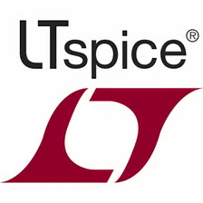
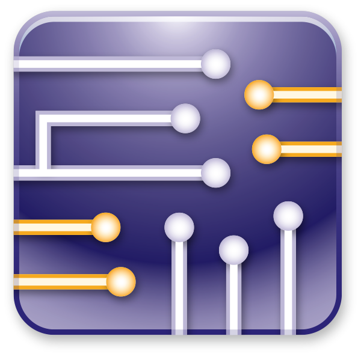

### Bonjour je suis Bertieux Teddy 👋
* En ce moment, je médite sur mon projet à venir 🤪
* 👯 Je cherche à collaborer sur des projets open-source et des initiatives communautaires.
* 📫 Vous pouvez me contacter ici [teddymamo@outlook.fr](mailto:teddymamo@outlook.fr).
### Mes compétences 🫡
* **Langages de programmation** :
    * Java ☕♨
    * HTML/CSS  , Javascript , Typescript 
    * C
    * Python 🐍
    * Matlab 
    * Assembly Z80 microprocessor
* **Frameworks et bibliothèques** :
    * Springboot , JEE
    * Angular 
* **Virtualisation** :
    * Conteneurisation : LXC/LXd, Docker
    * VMware, Virtualbox
* **Électronique** 🔋:
    * _électronique analogique_ : Radiofréquence, filtre, amplificatuer , régulateur
    * _électronique numérique_ : CPLD, VHDL
    * _électronique de puissance_ ⚡
    * _microcontroleur_ : PIC, AVR, arduino
    * capteur

* **Logiciels**:
    * Intellij idea , eclipse , VScode , Pycharm , Webstorm 
    * _Simulation électronique_ : LTspice , NI multisim , isis proteus , Tina-TI

